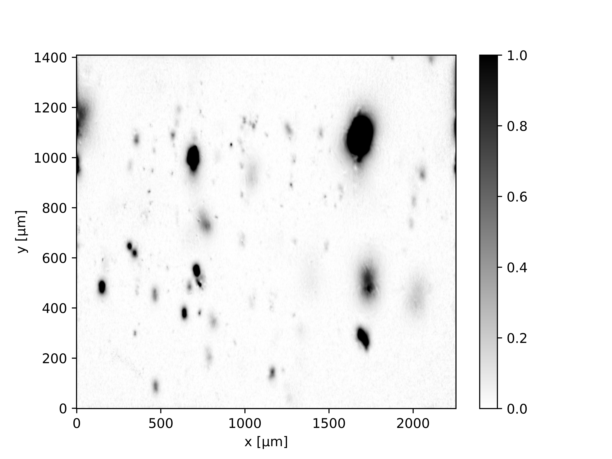

<!--
-------------------------------------------------------------------------------
This file defines the contents of each slide.
The reveal.js configuration can be found in index.html
-------------------------------------------------------------------------------
-->

<!-- .slide: class="slide-title" data-background-opacity="0.3" data-background-image="assets/magali-logo.svg" data-background-color="#000000" data-background-size="contain" -->

<!-- Place the content at the bottom of the slide -->

<h1 id="talk-title">
  
Towards an open source tool for the magnetic microscopy community 🧲🔬

</h1>

  <a id="talk-speaker"><b>Yago Moreira Castro</b></a>,
  Leonardo Uieda,
  Gelson Ferreira de Souza-Junior

<!-- Place location and date side-by-side with affiliation logos -->

<i class="fa fa-calendar-alt" style="margin: 0 10px 0 0"></i>
05 de Março  de 2025

Defesa de Mestrado em Geofísica | São Paulo, Brasil

<!-- Permission to reuse and CC-BY license logo -->
<i class="fa fa-camera" style="margin: 0 10px 0 0"></i>
Sinta-se à vontade para fotografar/compartilhar/reutilizar esta apresentação

<a href="https://creativecommons.org/licenses/by/4.0/"><i class="fab fa-creative-commons"></i><i class="fab fa-creative-commons-by" style="margin: 0 10px 0 2px"></i>CC-BY 4.0 License</a>

<!-- Add logos here. Need these wrappers to align them to the bottom right -->

  
  
  

===============================================================================
<h1>Sumário</h1>
<ul style="list-style: none; padding-left: 0;">
  <li class="fragment" style="color: red !important;">
    <b>Paleomagnetismo</b>
  </li>

  <li class="fragment">
    <b>Microscopia magnética</b>
  </li>

  <li class="fragment">
    <b>Métodos</b>
    <ul style="list-style: none;">
      <li class="fragment">Análise do Fluxo de Trabalho</li>
      <li class="fragment">Fundamentação Teórica</li>
      <li class="fragment">Desenvolvimento de software</li>
    </ul>
  </li>

  <li class="fragment">
    <b>Comparação de Performance e Acurácia</b>
  </li>

  <li class="fragment">
    <b>Demonstração em dados reais de microscopia magnética</b>
  </li>

  <li class="fragment">
    <b>Conclusões</b>
  </li>
</ul>

===============================================================================
# O que é Paleomagnetismo?
- O estudo do campo magnético da Terra conforme ele é **registrado** nas rochas

===============================================================================
# Como os minerais são magnetizados?

- <!-- .element: class="fragment" -->
  **Magnetização Remanente Termal (TRM):** rochas ígneas registram o campo magnético  à medida que esfriam abaixo do ponto de Curie (ex.: magnetita pura: **580°C**)

- <!-- .element: class="fragment" -->
  **Magnetização Remanente Deposicional (DRM):** partículas magnéticas em sedimentos se alinham com o campo magnético da Terra durante a deposição em ambientes aquáticos

===============================================================================
# Por que o paleomagnetismo é importante?

- <!-- .element: class="fragment" -->
  **Reversões geomagnéticas:** mostram que o campo magnético da Terra já se inverteu muitas vezes ao longo de sua história

- <!-- .element: class="fragment" -->
  **Deriva continental e tectônica de placas:** ajudou a confirmar a teoria da deriva continental e a reconstruir as posições passadas dos continentes

- <!-- .element: class="fragment" -->
  **Datação geológica:** utilizado como ferramenta de datação relativa ao comparar registros em rochas com a escala de tempo conhecida das reversões magnéticas (magnetoestratigrafia)

- <!-- .element: class="fragment" -->
  **Reconstrução do paleocampo:** permite compreender como o campo magnético da Terra evoluiu ao longo de centenas de milhões de anos

===============================================================================

  

===============================================================================

  

===============================================================================
<h1>Sumário</h1>
<ul style="list-style: none">
  <li><b>Paleomagnetismo</b></li>
  <li style="color: red !important;"><b>Microscopia magnética</b></li>
  <li>
    <b>Métodos</b>
    <ul style="list-style: none">
      <li>Análise do Fluxo de Trabalho</li>
      <li>Fundamentação Teórica</li>
      <li>Desenvolvimento de software</li>
    </ul>
  </li>
  <li><b>Comparação de Performance e Acurácia</b></li>  
  <li><b>Demonstração em dados reais de microscopia magnética</b></li>
  <li><b>Conclusões</b></li>
</ul>

===============================================================================

  

 

[Harvard Paleomagnetics Lab](https://paleomag.fas.harvard.edu/laboratory)

===============================================================================
<!-- .slide: class="slide-title" data-background-opacity="1" data-background-image="assets/ceramic.png"  data-background-size="contain" -->

[Souza-Junior et al 2024](https://agupubs.onlinelibrary.wiley.com/doi/10.1029/2023GC011082)

===============================================================================

===============================================================================

===============================================================================
# O Estudo de Bellon et al. (2025)

- **Investigaram** a aquisição de TRM por milhares de partículas nanoscópicas no **estado de vórtex**

- **Simularam** o comportamento desses conjuntos sob diversas intensidades campos magnéticos

- **Demonstraram** que o quando as partículas são afetadas com campos de maiores que **10 μT**, o paleocampo é registrado com extrema precisão (**erro angular < 1°**)

[Bellon et al. (2025)](https://agupubs.onlinelibrary.wiley.com/doi/full/10.1029/2025GL114771)

===============================================================================

===============================================================================
# Evolução da Inversão Magnética

- **Souza-Junior et al. (2024)** propuseram um novo fluxo de trabalho que adapta técnicas de aeromagnetometria e processamento de imagens para **isolar o sinal** de partículas individuais.

- **Estimaram** a posição das fontes via **Deconvolução de Euler**, utilizando essas coordenadas como base para calcular os momentos magnéticos por **inversão linear**.

[Souza-Junior et al. (2024)](https://agupubs.onlinelibrary.wiley.com/doi/full/10.1029/2023GC011082)

===============================================================================
# Evolução da Inversão Magnética

- **Souza-Junior et al. (2025)** aprimoraram  o método com uma **inversão não-linear iterativa**: o sinal das fontes já modeladas é subtraído dos dados, revelando novos grãos no campo residual.

- **Processaram** dados reais espeleotema, localizando e caracterizando **centenas de partículas** em apenas **alguns minutos**.

[Souza-Junior et al. (2025)](https://eartharxiv.org/repository/view/8869/)

===============================================================================
# Necessidades

- Algoritmos para **detecção automática** de **grãos magnéticos** e determinação de seus **momentos magnéticos**

- **Software aberto** para **modelagem direta** e técnicas de **inversão** específicas para microscopia magnética

- **Convenções de dados**

===============================================================================
<!-- .slide: data-background-opacity="1" data-background-image="assets/readme-banner.png"  data-background-size="contain" data-background-color="#262626" -->

===============================================================================
<!-- .slide: data-background-opacity="0.2" data-background-image="assets/magali-logo.png"  data-background-size="contain" data-background-color="#262626" -->

O que é o Magali?

Biblioteca em Python  <i class="fab fa-python"></i>

Software livre e de código aberto  

<i class="fab fa-github"></i> <i class="fas fa-lock-open"></i> <i class="fab fa-osi"></i>

Modelagem e processamento de dados de microscopia magnética  
<i class="fas fa-magnet"></i> <i class="fas fa-microscope"></i>

===============================================================================
<!-- .slide: data-background-opacity="0.2" data-background-image="assets/magali-logo.png"  data-background-size="contain" data-background-color="#262626" -->
# Por que queremos desenvolvê-la?

- Fornecer um código **fácil de usar**

- Determinar as **posições espaciais** de **múltiplos** grãos

- Facilitar a criação de **dados sintéticos**

- Propor um **formato padrão de dados**

- Servir como **base** para desenvolvimento de novos métodos

- Explorar o potencial de estudos emergentes em **microscopia magnética**

===============================================================================
<h1>Sumário</h1>
<ul style="list-style: none">
  <li><b>Paleomagnetismo</b></li>
  <li><b>Microscopia magnética</b></li>
  <li style="color: red !important;">
    <b>Métodos</b>
    <ul style="list-style: none">
      <li>Análise do Fluxo de Trabalho</li>
      <li>Fundamentação Teórica</li>
      <li>Desenvolvimento de software</li>
    </ul>
  </li>
  <li><b>Comparação de Performance e Acurácia</b></li>  
  <li><b>Demonstração em dados reais de microscopia magnética</b></li>
  <li><b>Conclusões</b></li>
</ul>

===============================================================================
# Análise do Fluxo de Trabalho

**1. Detecção e separação automática de fontes**
- **Calcula** a Amplitude do Gradiente Total (TGA) do campo vertical $b_z$ e ajusta o contraste
- **Identifica** as partículas automaticamente usando o algoritmo *Laplacian of Gaussian* (LoG) para segmentar espacialmente as fontes

===============================================================================
# Análise do Fluxo de Trabalho

**2. Estratégia progressiva de remoção de sinal**

Para cada janela detectada:

- **Modela** as anomalias mais fortes primeiro e remove suas contribuições progressivamente
- **Simplifica** o campo magnético para permitir que fontes mais fracas emerjam, aumentando a precisão da localização, apesar do maior custo computacional

===============================================================================
# Etapas da Inversão Iterativa

- **a) Estimativa de localização:** calcula a posição 3D inicial da fonte (para a janela atual) resolvendo um sistema linear via Deconvolução de Euler

- **b) Inversão linear do momento magnético:** estima o vetor de momento de dipolo inicial $\mathbf{m}$ resolvendo um problema de mínimos quadrados, assumindo a posição previamente calculada como fixa

- **c) Inversão não-linear híbrida:** refina simultaneamente a posição $\mathbf{v}$ (via esquema Levenberg-Marquardt) e reestima o momento $\mathbf{m}$ a cada iteração até a convergência

- **d) Remoção do sinal:** subtrai o sinal do dipolo modelado dos dados observados, gerando um mapa de resíduos que será utilizado nos próximos ciclos

===============================================================================
# Derivadas e TGA

- **Calculamos** a Amplitude do Gradiente Total (TGA) a partir do campo magnético vertical $b_z$, definida como a norma do vetor gradiente:

$$||\vec{\mathbf{\nabla}}f(x, y, z)|| = \sqrt{(\partial_x f)^2 + (\partial_y f)^2 + (\partial_z f)^2}$$

===============================================================================
# Derivadas e TGA

- **Aproximamos** as derivadas horizontais utilizando um esquema de **diferenças finitas centrais** de segunda ordem (assumindo espaçamento uniforme $\Delta x$):

$$\partial_x f(x, y, z) \approx \frac{f(x + \Delta x, y, z) - f(x - \Delta x, y, z)}{2 \Delta x}$$

$$\partial_y f(x, y, z) \approx \frac{f(x, y + \Delta y, z) - f(x , y + \Delta y, z)}{2 \Delta y}$$

- **Minimizamos** a amplificação de ruídos de curto comprimento de onda ao optar por diferenças finitas em vez da Transformada Rápida de Fourier (FFT) para as derivadas $x$ e $y$

===============================================================================
# Cálculo em Z

- **Obtemos** as variações no eixo vertical ($f(z + \Delta z)$ e $f(z - \Delta z)$) aplicando **continuação para cima e para baixo** no domínio do número de onda

[Saleh et al. (2012)](https://journals.savba.sk/index.php/cgg/article/view/5158/1272)

===============================================================================
# Vantagens do TGA

<ul>
  <li class="text-left fragment"><b>Gera</b> valores estritamente positivos</li>
  <li class="text-left fragment"><b>Centraliza</b> os picos diretamente sobre as fontes magnéticas</li>
  <li class="text-left fragment"><b>Minimiza</b> a dependência da direção de magnetização original</li>
  <li class="text-left fragment"><b>Realça</b> feições locais e <b>suprime</b> o <i>background</i> regional</li>
  <li class="text-left fragment"><b>Atua</b> como um <b>filtro passa-alta</b>, removendo ruídos de longo comprimento de onda</li>
</ul>

===============================================================================
# Realce de Contraste

- **Objetivo**: reescalonar os valores de TGA para destacar sinais fracos e fortes 
- **Operação**: transformação por pixel para normalizar os dados:

\[
\text{TGA}_{\text{rescaled}} = 2 \left( \frac{\text{TGA} - v_{\min}}{v_{\max} - v_{\min}} \right) - 1
\]

<ul>
<li>$ v_{\text{min}} = 1^\text{º} $ percentil</li>
<li>$ v_{\text{max}} = 99^\text{º} $ percentil</li>
<li><b>Saída:</b> valores reescalados para o intervalo $[0, 1]$</li>
</ul>

===============================================================================

# Por que usar limites por percentil?

- <!-- .element: class="fragment" -->
  **Escalonamento robusto**  
    Ignora outliers extremos (ex.: ruído do sensor)

- <!-- .element: class="fragment" -->
  **Validação empírica**  
    Funciona bem para dados reais de microscopia magnética

- <!-- .element: class="fragment" -->
  **Faixa dinâmica**  
    Garante a visualização de sinais fracos e fortes

===============================================================================

===============================================================================

# Filtro LoG

- **Utilizamos** o algoritmo *Laplacian of Gaussian* (LoG) para identificar os picos de intensidade (centros das partículas)

===============================================================================

# Filtro LoG

- **Suavizamos** a imagem primeiro com um kernel Gaussiano para eliminar ruídos de alta frequência:

$$G(x, y; \sigma) = \frac{1}{2\pi\sigma^2} e^{-\frac{x^2 + y^2}{2\sigma^2}}$$

- **Aplicamos** o operador Laplaciano (soma das derivadas de segunda ordem) para destacar zonas de variação rápida, atuando como um filtro passa-banda:

$$\nabla \cdot \nabla G(x, y; \sigma) = \frac{x^2 + y^2 - 2\sigma^2}{2\pi\sigma^4} e^{-\frac{x^2 + y^2}{2\sigma^2}}$$

===============================================================================
# Adaptação para Formas Elípticas (gLoG)

- **Implementamos** a versão generalizada (gLoG) para superar a limitação de simetria do filtro padrão e detectar partículas alongadas

===============================================================================
# Adaptação para Formas Elípticas (gLoG)

- **Calculamos** derivadas direcionais utilizando escalas independentes ($\sigma_x$, $\sigma_y$) e um ângulo de rotação ($\theta$):

$$x_\theta = x \cos \theta + y \sin \theta$$
$$y_\theta = -x \sin \theta + y \cos \theta$$

$$\text{gLoG}(x, y; \sigma_x, \sigma_y, \theta) = \sigma_x \sigma_y \left( \frac{\partial^2 G}{\partial x_\theta^2} + \frac{\partial^2 G}{\partial y_\theta^2} \right)$$

- **Garantimos** uma separação de fontes altamente precisa, robusta contra ruídos e adaptável a variações no tamanho e formato dos grãos

[Marr & Hildreth (1980)](https://www.google.com/url?sa=D&q=https://doi.org/10.1098/rspb.1980.0020&ust=1772178120000000&usg=AOvVaw059bB5Z6yShXdK7B2Con1D&hl=pt-BR&source=gmail)

[Kong et al. (2013)](https://ieeexplore.ieee.org/document/6408211)

===============================================================================
# Filtro gLoG

- **O Desafio:** dados reais de microscopia contêm ruídos instrumentais e pequenas variações de alta frequência que geram "falsos positivos" na detecção

- **Gaussiano (Suavização):** aplicamos um filtro que atua como um "desfoque" da imagem. Ele apaga os ruídos pequenos e preserva apenas a forma principal da imagem

- **Laplaciano (Detecção):** com o dado já limpo, calculamos a curvatura do sinal para encontrar o seu ponto de inflexão mais agudo, identificando o centro da partícula

===============================================================================
<section>

<pre class="compact"><code class="python" data-trim data-noescape>

# Import standard Python libraries
import numpy as np
import skimage.exposure
import xarray as xr
import matplotlib.pyplot as plt

# Import Fatiando a Terra libraries
import harmonica as hm
import ensaio
import magali

# Download the data
fname = ensaio.fetch_morroco_speleothem_qdm(version=1, file_format="matlab")
data = magali.read_qdm_harvard(fname)
</code></pre>
</section>

===============================================================================
<section>

<pre class="compact"><code class="txt" data-trim data-noescape>
xarray.DataArray 'bz' (y: 600, x: 960)> Size: 5MB
array([[ 352.40587477,   94.8913792 ,   41.61924299, ...,  470.18833933,
         129.20055397,   18.50120941],
       [ 525.04809649,  624.84659897,   53.45418   , ...,  450.42515609,
         240.12455308,  -73.61367693],
       [ 105.0939369 ,  638.76559489,  307.60736872, ...,  236.91326522,
         386.8498122 ,  -86.44215589],
       ...,
       [ -83.74367957,   32.98078244, -411.75073652, ...,  745.99373583,
        1036.20033954, -140.64317643],
       [ 171.17113661, -214.47801235,  159.23437984, ...,  124.58138395,
         258.54331931,  -90.3376945 ],
       [  80.60950354,  273.08367487,  118.23499313, ...,   -4.19572521,
         -53.55728012,    2.10335918]])
Coordinates:
  * x        (x) float64 8kB 0.0 2.35 4.7 7.05 ... 2.249e+03 2.251e+03 2.254e+03
  * y        (y) float64 5kB 0.0 2.35 4.7 7.05 ... 1.403e+03 1.405e+03 1.408e+03
    z        (y, x) float64 5MB 5.0 5.0 5.0 5.0 5.0 5.0 ... 5.0 5.0 5.0 5.0 5.0
Attributes:
    long_name:  vertical magnetic field
    units:      nT
</code></pre>
</section>

===============================================================================
<!-- .slide: data-background-image="assets/qdm_data.png"  data-background-size="contain" data-background-color="#262626" -->

===============================================================================
<section>

<pre class="compact"><code class="python" data-trim data-noescape>

# Upward continuation
height_difference = 5.0 # μm
data_up = (
    hm.upward_continuation(data, height_difference)
    .assign_attrs(data.attrs)
    .assign_coords(x=data.x, y=data.y)
    .assign_coords(z=data.z + height_difference)
    .rename("bz")
)

</code></pre>
</section>

===============================================================================
<!-- .slide: data-background-image="assets/data_up.png"  data-background-size="contain" data-background-color="#262626" -->

===============================================================================
<section>

<pre class="compact"><code class="python" data-trim data-noescape>

# Calculate Total Gradient Amplitude (TGA)
dx, dy, dz, tga = magali.gradient(data_up)
data_up["dx"], data_up["dy"], data_up["dz"], data_up["tga"] = dx, dy, dz, tga

# Stretch the contrast of TGA image
stretched = skimage.exposure.rescale_intensity(
    tga, in_range=tuple(np.percentile(tga, (1, 99)))
)
data_tga_stretched = xr.DataArray(stretched, coords=data_up.coords)

</code></pre>
</section>

===============================================================================
<!-- .slide: data-background-image="assets/stretched.png"  data-background-size="contain" data-background-color="#262626" -->

===============================================================================
<section>

<pre class="compact"><code class="python" data-trim data-noescape>

# Detect anomalies
bounding_boxes = magali.detect_anomalies(
    data_tga_stretched,
    size_range=[20, 150],
    detection_threshold=0.02,
    border_exclusion=2,
)

</code></pre>
</section>

===============================================================================
<!-- .slide: data-background-image="assets/detection.png"  data-background-size="contain" data-background-color="#262626" -->

===============================================================================
<section>

<pre class="compact"><code class="python" data-trim data-noescape>

# Iterative nonlinear inversion
data_updated, locations_, dipole_moments_, r2_values = magali.iterative_nonlinear_inversion(
    data_up,
    bounding_boxes,
    height_difference=height_difference,
    copy_data=True,
)

</code></pre>
</section>

===============================================================================
<section>

<pre class="compact"><code class="python" data-trim data-noescape>

# Plot the data

locations_arr = np.array(locations_)

fig, ax = plt.subplots()

data.plot.pcolormesh(ax=ax, cmap="seismic", vmin=-10000, vmax=10000)

magali.plot_bounding_boxes(bounding_boxes, ax=ax, color="black", linewidth=1.5)

ax.scatter(
    locations_arr[:, 0],  # x
    locations_arr[:, 1],  # y
    c="green",
    marker=".",
    s=60,
    label="Dipole estimated location"
)
plt.legend()

plt.show()

</code></pre>
</section>

===============================================================================
<!-- .slide: data-background-opacity="1" data-background-image="assets/magali_code_example.png"  data-background-size="contain" data-background-color="#262626" -->

===============================================================================
# Conclusions

- Magnetic microscopy lets us investigate magnetism at the grain scale

- <strong>Magali</strong> brings <b>automation, reproducibility</b>, and <b>speed</b> to these analyses

  - It integrates open tools,

===============================================================================
# Conclusions

- Magnetic microscopy lets us investigate magnetism at the grain scale

- <strong>Magali</strong> brings automation, reproducibility, and speed to these analyses

  - It integrates open tools, FAIR data,

<b>FAIR</b>: <b>F</b>indable, <b>A</b>ccessible, <b>I</b>nteroperable and <b>R</b>eusable

===============================================================================
# Conclusions

- Magnetic microscopy lets us investigate magnetism at the grain scale

- <strong>Magali</strong> brings automation, reproducibility, and speed to these analyses

- It integrates open tools, FAIR data, and transparent workflows for magnetic research

===============================================================================
# Future work

- Provide, discuss, and establish <b>data conventions</b> for magnetic microscopy

- Write functions to read data from <b>different microscope systems</b>

- Add more datasets to <b>Ensaio</b> for testing and <b>community use</b>

- Release <strong>Magali 1.0</strong> with improved docs and structure

===============================================================================

# Acknowledgements

===============================================================================
<!-- .slide: data-background-opacity="0.2" data-background-image="assets/magali-logo.png"  data-background-size="contain" data-background-color="#262626" -->
# Obrigado! ¡Gracias! Thank you!

<i class="fas fa-comments"></i>
 
Contact:
<a>yagomcastro1@gmail.com</a>

<i class="fab fa-github"></i>
 
Source code for this presentation:
 
[github.com/YagoMCastro/sbgf-magali-presentation](https://github.com/YagoMCastro/sbgf-magali-presentation)

<i class="fab fa-creative-commons"></i><i class="fab fa-creative-commons-by"></i>
 
The contents of this presentation are
licensed under the
 
[Creative Commons Attribution 4.0 International License](https://creativecommons.org/licenses/by/4.0/).

[github.com/fatiando/magali](https://github.com/fatiando/magali)

